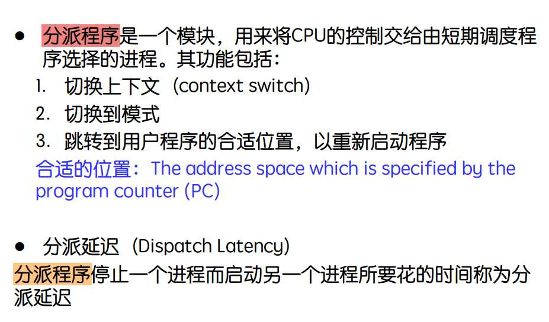

图片内容讨论了**分派程序（Dispatcher）** 和**分派延迟（Dispatch Latency）** 的相关概念，这些都是操作系统调度的核心部分。以下是详细解释：

---

### **1. 分派程序（Dispatcher）的定义**
- **分派程序**是操作系统中用于管理CPU调度的一个模块。
- 它的职责是将CPU的控制权交给短期调度器选择的进程，确保当前的运行进程与调度策略相匹配。

---

### **2. 分派程序的主要功能**
分派程序在进程调度中的关键步骤包括：

1. **切换上下文（Context Switch）**：
   - 上下文切换是指保存当前进程的状态（如寄存器内容、程序计数器等）并恢复即将运行的进程的状态。
   - 这是分派程序的重要任务，确保进程能从之前中断的位置继续执行。

2. **切换到模式（Mode Switch）**：
   - 切换CPU的执行模式，例如从内核模式（Kernel Mode）切换到用户模式（User Mode）。
   - 这是必要的，因为用户进程通常在用户模式下运行，而调度器在内核模式下工作。

3. **跳转到用户程序的合适位置**：
   - 恢复即将运行的进程的程序计数器（Program Counter，PC），跳转到该进程的代码中指定位置并开始执行。
   - **合适的位置**是指程序中断时的状态或进程的起始位置，由程序计数器决定。

---

### **3. 分派延迟（Dispatch Latency）**
- **定义**：分派延迟是指分派程序完成从一个进程切换到另一个进程的操作所需的时间。
- 这是调度程序性能的一个重要指标。

#### **分派延迟的组成**
分派延迟主要包括以下几个部分：
1. **上下文切换时间**：
   - 保存当前进程的状态并加载新进程的状态。
2. **模式切换时间**：
   - CPU从内核模式切换到用户模式。
3. **跳转时间**：
   - 恢复程序计数器并跳转到新进程的合适位置。

---

### **4. 分派程序和分派延迟的意义**
1. **分派程序的意义**：
   - 分派程序是实现多任务操作系统的关键组件，确保进程能按照调度器的策略公平、有效地使用CPU资源。
   - 它直接影响系统的响应时间和任务的完成效率。

2. **分派延迟的意义**：
   - 分派延迟越小，系统的响应速度越快。
   - 实时系统对分派延迟要求特别高，因为延迟可能会影响任务的时效性。

---

### **5. 举例说明**
假设一个系统中运行三个进程：
- 当前正在运行进程A，但调度器决定切换到进程B。
- 分派程序的步骤：
  1. 保存进程A的上下文（如寄存器、PC）。
  2. 恢复进程B的上下文。
  3. 切换到用户模式并跳转到进程B的程序计数器位置，开始运行进程B。

**分派延迟**就是完成上述操作所需的时间。

---

### **6. 如何减少分派延迟**
为了提高系统性能，分派延迟需要尽可能减少，可以采取以下措施：
1. **优化上下文切换**：
   - 减少保存和恢复状态的时间，使用硬件支持（如寄存器窗口）。
2. **减少模式切换开销**：
   - 优化用户模式与内核模式之间的切换。
3. **提高调度器效率**：
   - 简化调度算法，减少决策时间。

---

### **总结**
- **分派程序**是管理CPU调度的核心模块，负责在进程之间切换，确保多任务系统的正常运行。
- **分派延迟**是影响系统响应速度的重要指标，主要由上下文切换、模式切换和程序跳转组成。
- 在实时系统中，分派延迟需要尽可能小，以保证任务的及时执行。