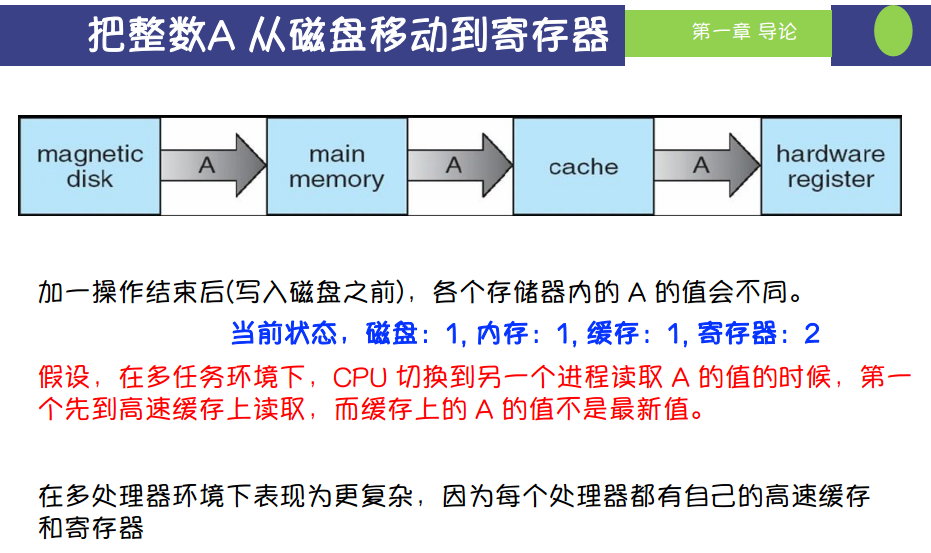

根据图片内容，描述的是从磁盘到寄存器传递数据的多级存储过程（磁盘->内存->缓存->寄存器）以及在多任务和多处理器环境下可能导致数据不一致的问题。这种场景会出现许多潜在问题，以下列举5个常见问题及其对应的例子：

---

### **1. 数据不一致（Data Inconsistency）**
- **问题描述**：
  在多核或多处理器系统中，每个处理器可能有自己的缓存。如果一个处理器修改了缓存中的数据，而其他处理器仍在使用旧的数据，就会出现不一致。
- **例子**：
  假设处理器A从缓存中读取`A=1`，同时处理器B将`A`更新为`A=2`，但处理器A的缓存未同步，导致处理器A继续使用过时的值`A=1`。

---

### **2. 缓存失效（Cache Coherence Issue）**
- **问题描述**：
  缓存一致性协议（如MESI协议）用于确保多个处理器的缓存一致性，但如果协议没有正确工作，可能导致缓存无效或更新失败。
- **例子**：
  在某个时刻，处理器A写入了`A=3`，但处理器B的缓存未收到更新通知，导致两者的缓存数据不一致。

---

### **3. 数据竞争（Data Race）**
- **问题描述**：
  如果多个任务或线程同时访问同一数据，并且至少有一个是写操作，而没有适当的同步机制，就会产生数据竞争。
- **例子**：
  线程1从内存中读取变量`A=5`并将其加1，准备写回时，线程2同时读取了`A=5`并执行相同操作。最终结果可能是`A=6`而不是预期的`A=7`。

---

### **4. 写入丢失（Write Loss Issue）**
- **问题描述**：
  在多任务环境中，多个进程可能会覆盖彼此的写入操作，导致某些写入丢失。
- **例子**：
  进程1将`A`更新为`A=10`并写入磁盘，随后进程2将`A`更新为`A=20`，但进程1的写入被完全覆盖，未被记录。

---

### **5. 更新延迟（Propagation Delay）**
- **问题描述**：
  更新从寄存器到磁盘的传播需要一定时间，如果任务之间没有同步，会导致数据的延迟更新问题。
- **例子**：
  处理器A将变量`A`更新为`A=15`，但更新还未写回磁盘时，另一个处理器读取了旧的磁盘值`A=10`，导致错误的决策或结果。

---

### **解决方法**
为了避免上述问题，常用的解决方案包括：
1. **缓存一致性协议**：如MESI、MOESI等，确保缓存数据一致。
2. **加锁或同步机制**：使用互斥锁、信号量等，避免数据竞争。
3. **事务管理**：确保一组操作要么全部完成，要么全部撤销。
4. **版本控制**：为数据分配版本号以确保正确的更新顺序。
5. **内存屏障（Memory Barrier）**：确保数据的更新顺序。

这些方法可以有效缓解或解决在多任务和多处理器环境下的数据一致性问题。