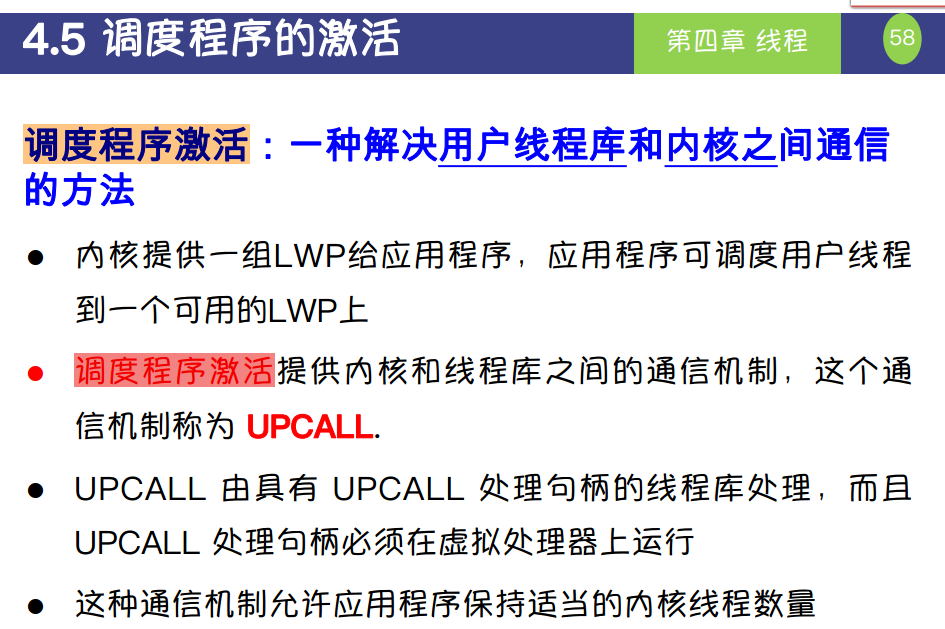

这段内容讨论了**调度程序激活（Scheduler Activations）** 的概念，这是操作系统和用户线程库之间通信的一种机制，用于高效管理线程。以下是详细解释：

---

### **1. 什么是调度程序激活？**
- **定义**：
  调度程序激活是一种机制，用于解决用户线程库和内核之间的通信问题，确保用户线程能够高效地利用内核线程资源。

- **目的**：
  - 在用户线程和内核线程之间建立高效的通信机制。
  - 提供用户线程库对线程管理的灵活控制，同时充分利用内核的线程调度能力。

---

### **2. 关键概念**
1. **LWP（轻量级进程，Lightweight Process）**：
   - 内核为应用程序提供的一组轻量级进程。
   - 应用程序中的用户线程可以调度到一个可用的LWP上运行，用户线程和LWP之间的映射关系由用户线程库管理。

2. **调度程序激活**：
   - **功能**：调度程序激活提供用户线程库和内核之间的通信机制，允许用户线程库通过这种机制管理线程的状态和资源。
   - **信号机制**：这个机制被称为**UPCALL**。

---

### **3. 什么是UPCALL？**
- **UPCALL的定义**：
  UPCALL是内核到用户线程库的通知机制，用户线程库通过UPCALL响应来自内核的事件，例如：
  - 某个线程阻塞或完成。
  - 系统需要创建或销毁线程。

- **UPCALL的特性**：
  - **内核触发**：当内核检测到需要与用户线程库通信的事件时，会触发UPCALL。
  - **用户线程库处理**：UPCALL调用用户线程库中的特定处理逻辑，以便对线程状态进行调整。
  - **虚拟处理器运行**：UPCALL处理的代码必须运行在虚拟处理器上，这确保了UPCALL不会中断正常的线程操作。

---

### **4. 调度程序激活的优点**
1. **用户线程的高效调度**：
   - 用户线程可以在用户态被管理，减少了内核态的调度开销。
2. **灵活性**：
   - 应用程序可以自定义线程库的行为，以满足特定需求。
3. **并发性**：
   - 允许用户线程库动态调整线程数量，确保合适的线程数量与内核线程（LWP）匹配。
4. **高效资源利用**：
   - 通过用户线程库控制线程的调度，避免了内核频繁切换线程的开销。

---

### **5. 实际工作流程**
以下是调度程序激活的典型工作流程：
1. **线程阻塞**：
   - 当某个线程阻塞时（例如I/O操作），内核通过UPCALL通知用户线程库。
   - 用户线程库可以决定是否将该线程重新调度到其他LWP上运行，或者创建新的线程替代。
   
2. **线程完成**：
   - 当某个线程的任务完成时，内核会通过UPCALL通知用户线程库，用户线程库可以释放资源或调度其他线程运行。

3. **线程调度**：
   - 用户线程库根据UPCALL提供的信息，动态调整线程的映射关系，确保线程总数与LWP数量保持合理匹配。

---

### **6. 调度程序激活的意义**
调度程序激活的引入解决了用户线程和内核线程的协调问题，带来了以下好处：
- 提高了多线程程序的性能和响应速度。
- 提供了灵活的线程管理能力，适应不同的应用场景。
- 减少了用户线程和内核线程之间的调度开销。

---

### **总结**
- **调度程序激活**是一种机制，用于在用户线程库和内核之间建立高效的通信桥梁。
- **UPCALL**是调度程序激活的核心，负责内核和用户线程库之间的事件传递。
- 它既保证了用户线程管理的灵活性，又确保了线程和内核资源的高效利用，是一种平衡性能和灵活性的解决方案。